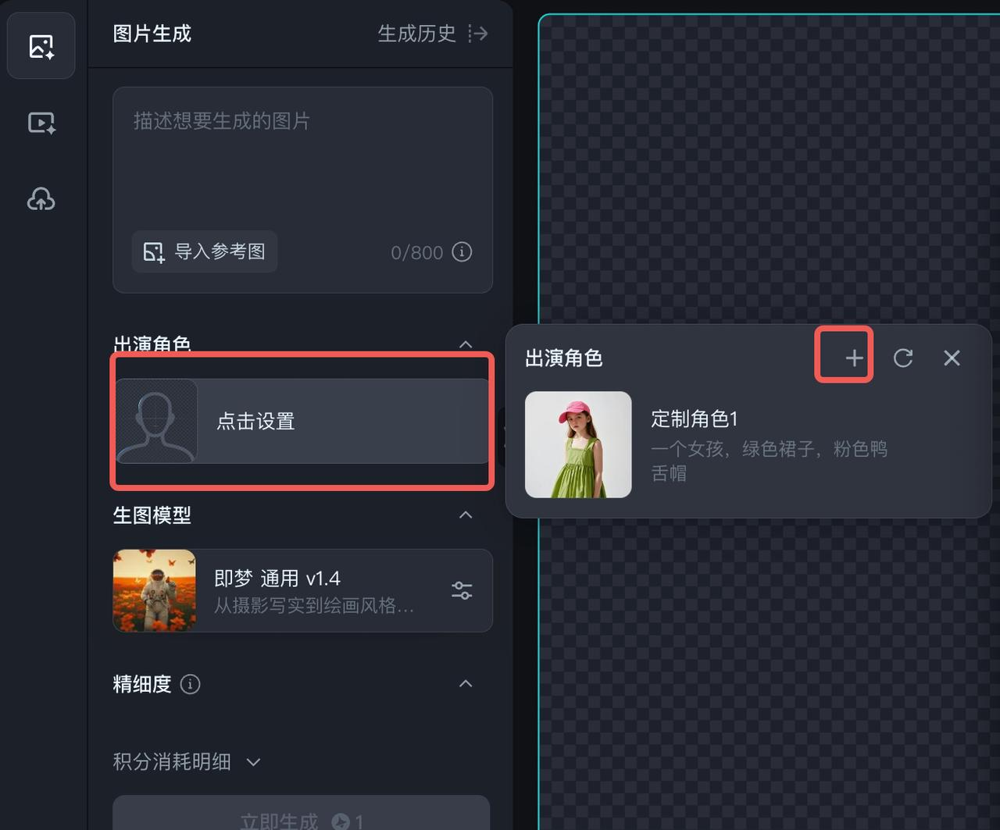
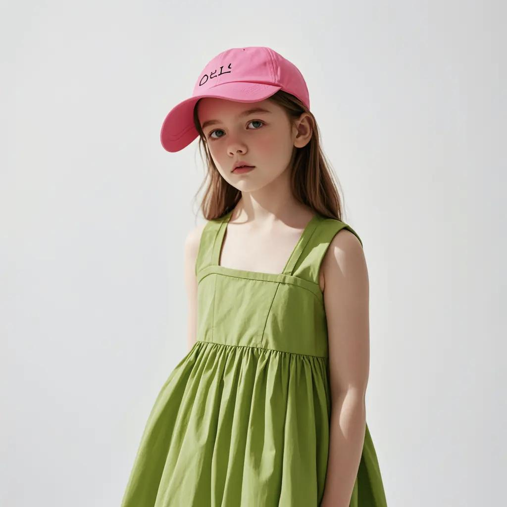

# RealCustom++

Existing text-to-image customization (or subject-driven generation) methods follow the pseudo-word paradigm, 
which involves representing given subjects as pseudo-words and combining them with given texts to collectively guide the generation.
However, the inherent conflict and entanglement between the pseudo-words and texts result in a dual-optimum paradox, where subject similarity and text controllability cannot be optimal simultaneously.
In this paper, we present RealCustom++, for the first time, disentangles subject similarity from text controllability and thereby allows both to be optimized simultaneously without any conflicts.
The core idea of RealCustom++ is to represent given subjects as real words that can be seamlessly integrated with given texts, 
and further leveraging the relevance between real words and image regions to disentangle subjects from texts. 


## Enjoy on [Dreamina](https://jimeng.jianying.com/ai-tool/home) at Two Steps
RealCustom++ has now been commercially applied in Dreamina, ByteDance. 
You can enjoy the customized generation for any subjects you like following the two steps:

1. **Step 1: Create A Character**: 
Create character images and corresponding appearance descriptions through prompt descriptions, uploading reference images. Specifically:
    1. **Character Image**: Best in clean background, close-up, prominent subject, high-quality resolution.
    2. **Character Description**: Brief, includes the subject and key appearance elements.

通过prompt描述、上传参考图片或者文本生成图像创建角色图片和对应外观描述，其中
    1. 角色图片-最好是干净背景，主体突出，画质清晰的图像
    2. 角色描述-简短，包含主语和关键外观元素



An example of the character image:



2. **Step 2: Character-Driven Generation**:


## About Code Release

## Reference

```
@inproceedings{huang2024realcustom,
  title={RealCustom: Narrowing Real Text Word for Real-Time Open-Domain Text-to-Image Customization},
  author={Huang, Mengqi and Mao, Zhendong and Liu, Mingcong and He, Qian and Zhang, Yongdong},
  booktitle={Proceedings of the IEEE/CVF Conference on Computer Vision and Pattern Recognition},
  pages={7476--7485},
  year={2024}
}
```