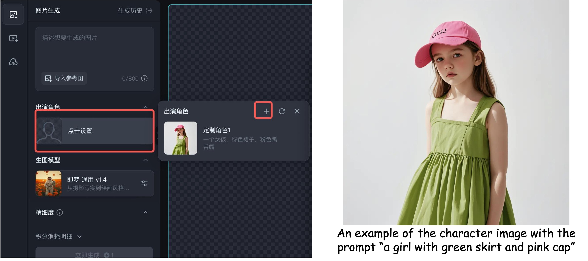
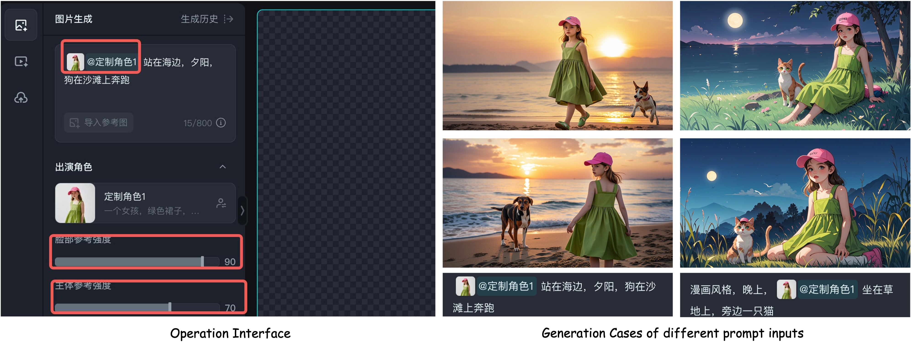
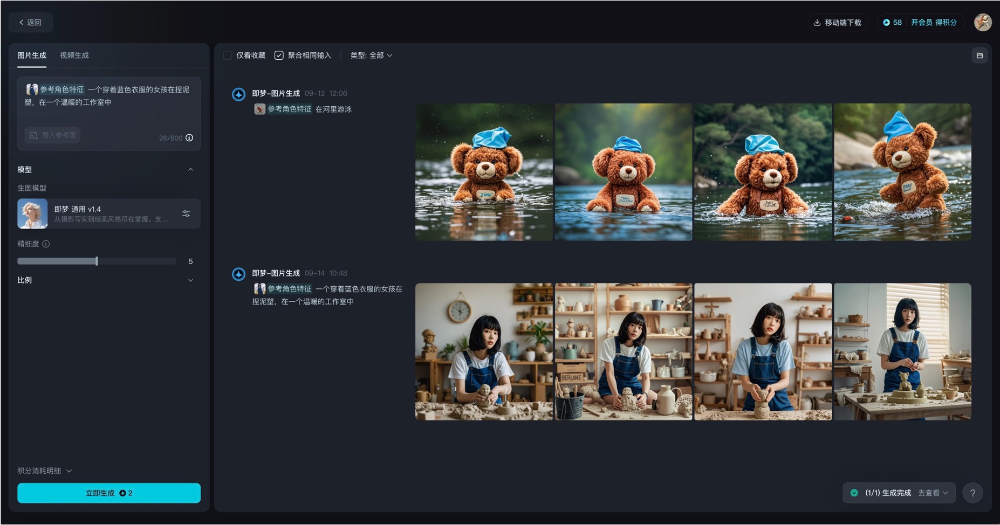

# RealCustom++

Existing text-to-image customization (or subject-driven generation) methods follow the pseudo-word paradigm, 
which involves representing given subjects as pseudo-words and combining them with given texts to collectively guide the generation.
However, the inherent conflict and entanglement between the pseudo-words and texts result in a dual-optimum paradox, where subject similarity and text controllability cannot be optimal simultaneously.
In this paper, we present RealCustom++, for the first time, disentangles subject similarity from text controllability and thereby allows both to be optimized simultaneously without any conflicts.
The core idea of RealCustom++ is to represent given subjects as real words that can be seamlessly integrated with given texts, 
and further leveraging the relevance between real words and image regions to disentangle subjects from texts. 


## Enjoy on [Dreamina](https://jimeng.jianying.com/ai-tool/home) at Two ways
RealCustom++ has now been commercially applied in Dreamina and Doubao, ByteDance. 
You can enjoy the customized generation for any subjects you like by calling the following APIs:

### Image Generation (Story Mode) in two steps:

#### Step 1: Create A Character: 
Create character images and corresponding appearance descriptions through prompt descriptions, uploading reference images. Specifically:
    1. **Character Image**: Best in clean background, close-up, prominent subject, high-quality resolution.
    2. **Character Description**: Brief, includes the subject and key appearance elements.



#### Step 2: Character-Driven Generation:
Input prompts where the subject is replaced by the selected character, guiding the character to make corresponding changes such as style, actions, expressions, scenes, and modifiers. 
There is no need to add descriptions of the subject in the prompt. "Face Reference Strength" is the weight for ID retention, and "Body Reference Strength" is the weight for IP retention.



### Image Generation in one step:
In this mode, we automatically detect or generate the target words for you, so you don't need to specify the target words as you would in the story mode.




## About Code Release
Unfortunately, according to company policy, considering the model's performance is closely aligned with Dreamina's online effects, we are **currently** unable to open-source the code and model. **We plan to open-source RealCustom++ after the next version update in Dreamina. Please stay tuned!**


## Reference

```
@inproceedings{huang2024realcustom,
  title={RealCustom: Narrowing Real Text Word for Real-Time Open-Domain Text-to-Image Customization},
  author={Huang, Mengqi and Mao, Zhendong and Liu, Mingcong and He, Qian and Zhang, Yongdong},
  booktitle={Proceedings of the IEEE/CVF Conference on Computer Vision and Pattern Recognition},
  pages={7476--7485},
  year={2024}
}
```